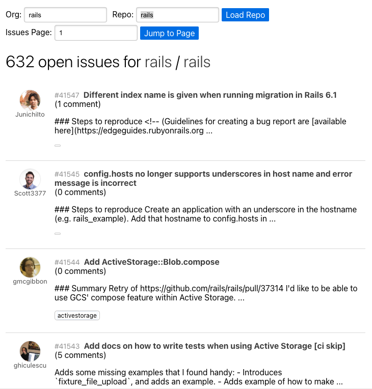

# Zilch Interview Task

## Details

Using the GitHub API defined in [githubAPI.ts](./src/app/api/githubAPI.ts), create an interface to browse the issues of a GitHub repository.

Repos are fetched jointly by their organisation names and repo names:

```
https://github.com/discord/focus-rings
```

`discord` is the org name, `focus-rings` is the repo name.

Your interface must allow the input of both values, and then dipslay the issues for that repository.

Navigating to view an issue can then show the comments on that issue, as well as details about the issue.

## Your Solution

Your solution must leverage Redux for state management, as well as Sagas for asynchronous fetching.

`@reduxjs/toolkit` is included and imported by default. This toolkit is useful, but it is not mandatory that you use it. If you'd rather write reducers and actions yourself, without the toolkit, feel free - as long as they are still well tested, and typed.

You must also write tests - test coverage of the whole application does not matter, please focus on having at least one test for each different part, such as for UI, reducers, actions, selectors, sagas, etc.

Do not worry about styling or nice UI - the "reactstrap" library is included, which providers Bootstrap styling as React components, which will provide you with ample functionality to create the barebones UI necessary.

Here is an example screenshot, for inspiration. Your solution does not have to look like this, but it illustrates the basic concept of entering the repo name and org name, and fetching the issues for that repo.


